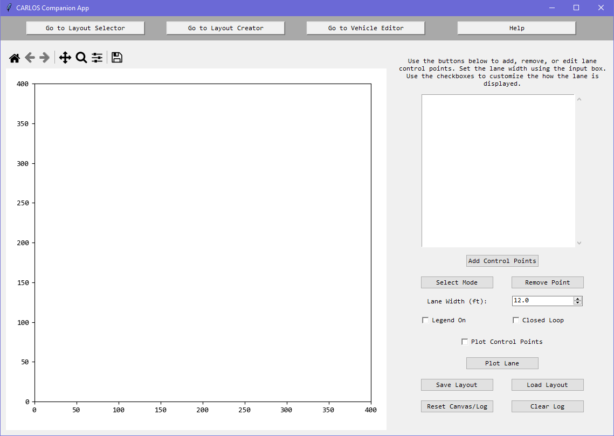
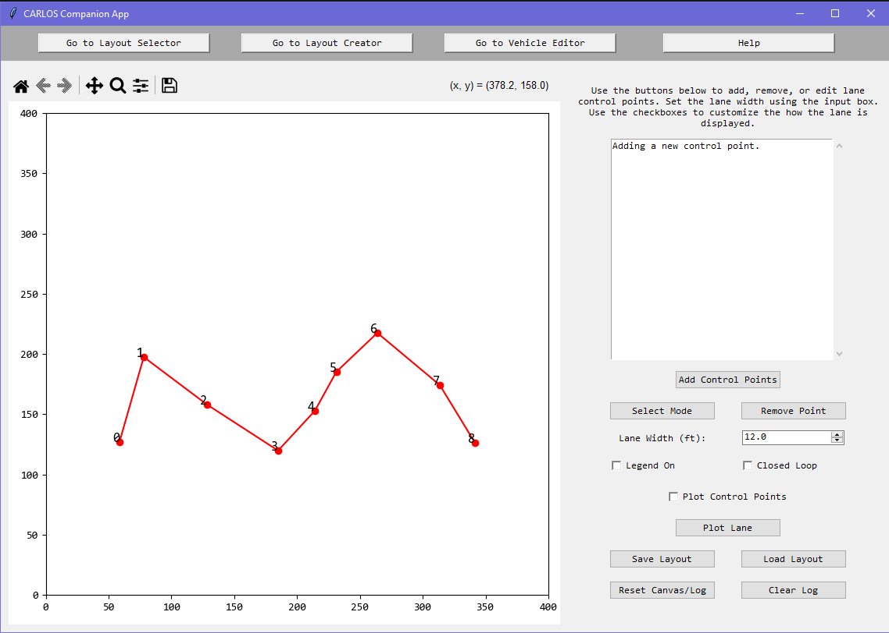
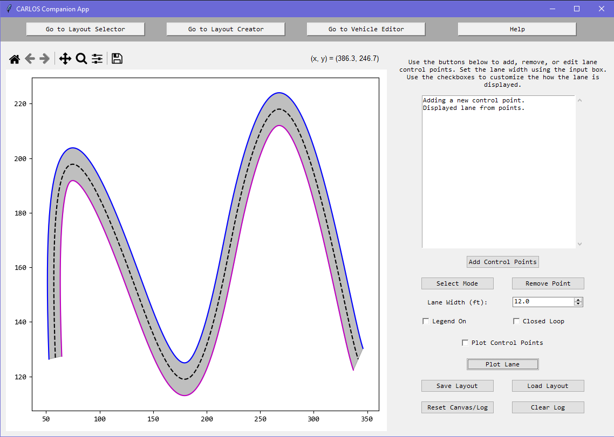
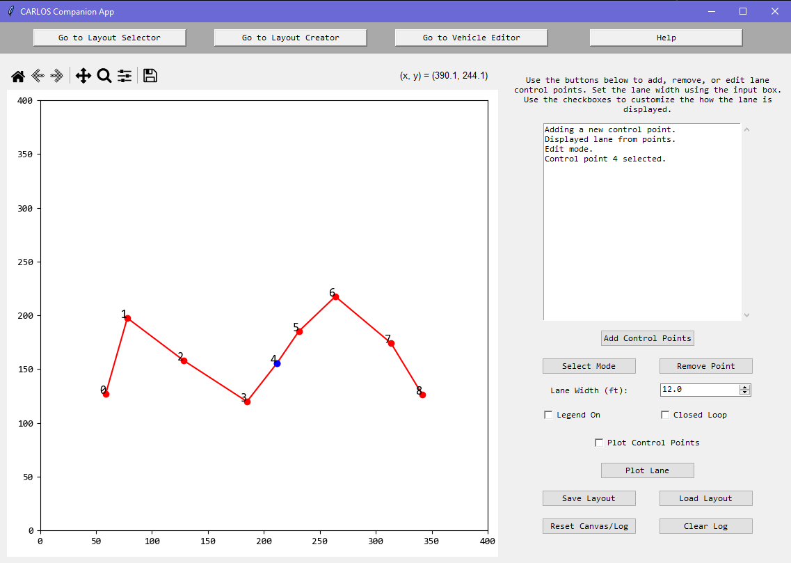
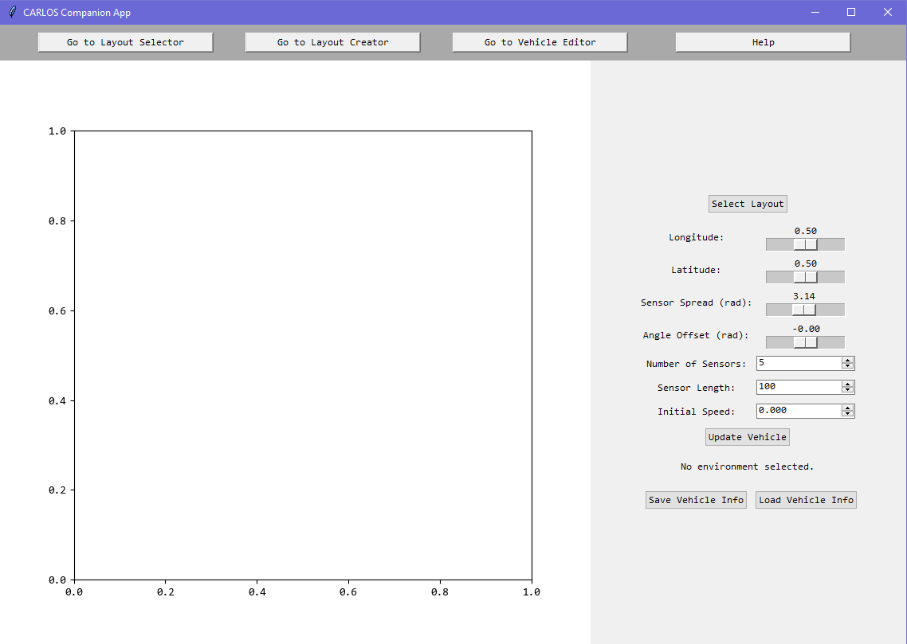
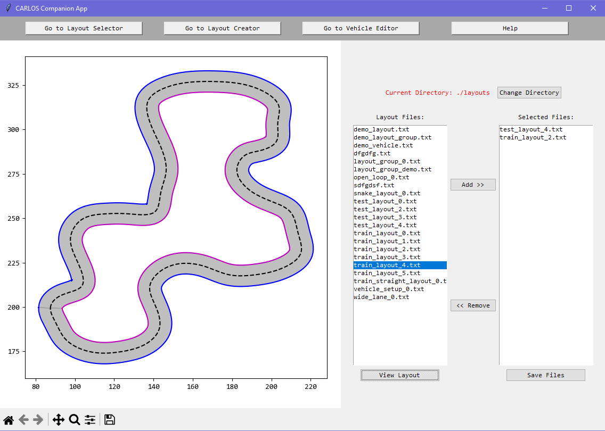
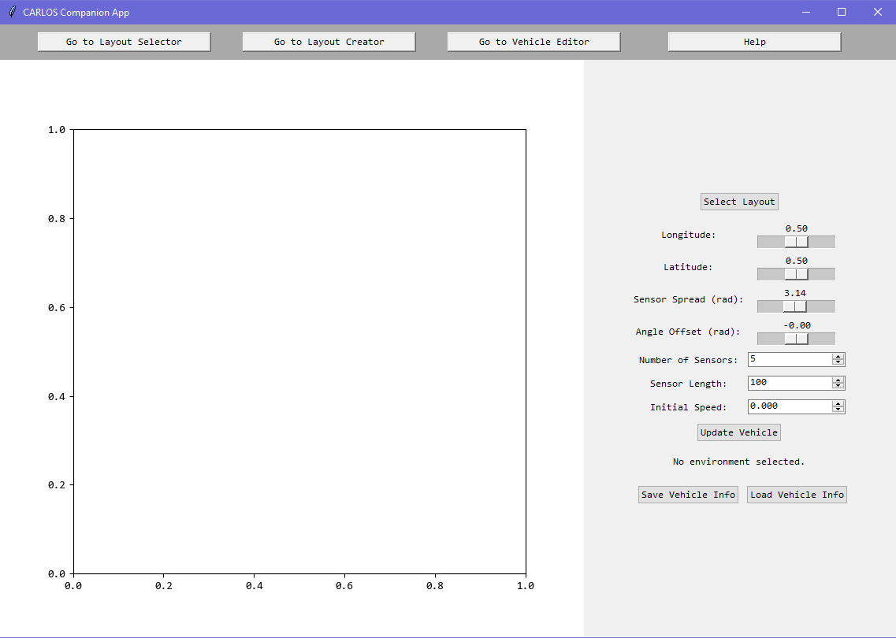
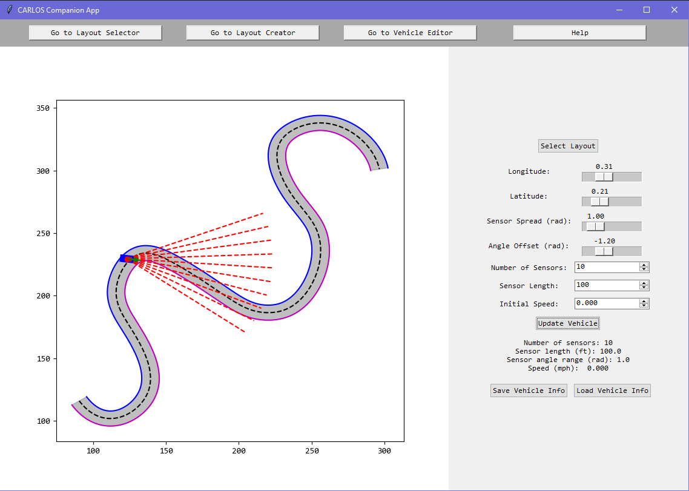
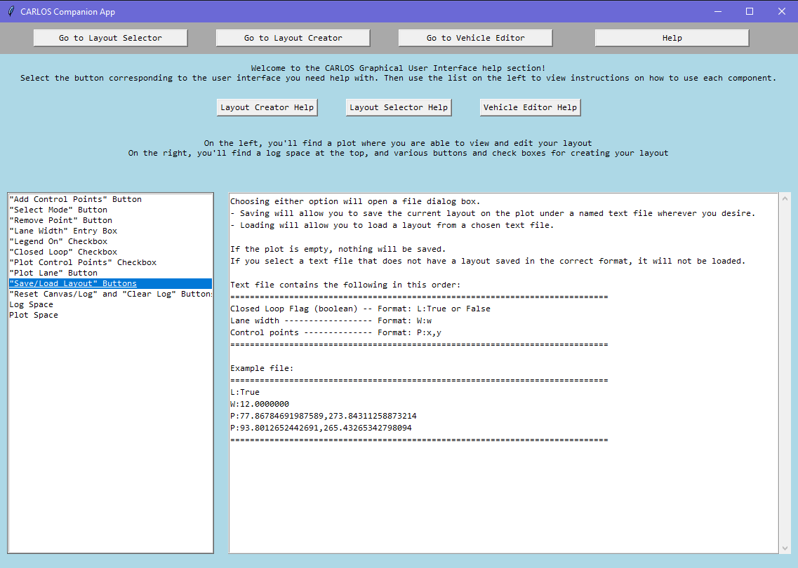

# SEMBAS-RL
This repository includes:
1) CARLoS, a low-fidelity, lightweight simulator for the safety testing of ML-based AV agents
2) [SEMBAS](https://ieeexplore.ieee.org/abstract/document/10210870) applied to Reinforcement Learning agent training in CARLoS.


# Setting up CARLOS:
These instructions are in linux.

1. Clone main branch

2. Install dependencies

To install the dependencies, run the following command from the main SEMBAS-RL folder:
```
pip install -r requirements.txt
```
These need to have installed with no issues for the test of the steps.

4. From the src folder, run the "test_app.py" file. 
```
python test_app.py
```
or
```
py test_app.py
```
The output will be in the console and several plots will be displayed. 

See  for what is displayed and in what order. If you get to "App Test: All tests PASSED" then it means everything is working how it should.

## Testing CARLOS Execution
Run the "carlos_app_pres_agent.py" from the src folder with the following command:
```
python carlos_app_pres_agent.py
```
You should see a plot show and the vehicle moving on the lane. If the vehicle leaves the lane, it will be randomly reset back on the lane and will continue. Its an endless loop. Use ctrl+C to escape.

# Initializing CARLOS Components
The following describes how to initialize each of the components in CARLOS:

## Lane -> located in lane.py
**_Requires: List of control points (```Point``` objects from ```point.py```), closed loop boolean flag, lane width as a float._**

The control points are the only necessary parameter. The lane width is defaulted to ```12.0``` and the closed loop flag is set to ```False``` (meaning it is not a continuous lane).

These can be hard coded such as:
```python
control_points = [Point(0, 0), Point (100, 100)]
lane_width = 11.0
closed_loop = False
```
OR you can load an existing lane from a file using the ```layout_utils.py``` function called ```load_lane_from_file```.
The method takes in a file path. The default is the file_path is None, meaning the user will select a file from the file system using the file explorer.
If a file path is provided and the file contains a valid layout, the method returns the control points, lane width, and closed loop flag.

Use the following command: 
```python
control_points, lane_width, closed_loop = layout_utils.load_lane_from_file(file_path)
```

Create the lane object with the following line:
```python
new_lane = Lane(control_points, lane_width, closed_loop)
```

## Environment -> located in environment.py
**_Requires: An Lane object_**
1. Create a lane object as described above.
2. Create the environment object:
```python
new_environment = Environment(new_lane)
```

## Vehicle -> located in vehicle.py
The vehicle has the following _optional_ parameters, with the types and default values as listed, in this order:
- ```vehicle_length_ft: float = 10``` -> Length of the vehicle in feet
- ```vehicle_width_ft: float = 6``` -> Width of the vehicle in feet
- ```min_speed_mph: float = 0.0``` -> THe minimum possible speed for the vehicle in miles per hour
- ```max_speed_mph: float = 150.0``` -> The maximum possible speed for the vehicle in miles per hour
- ```sec_0_to_60: float = 8.0``` -> How many seconds it takes for the vehicle to go 0 to 60 miles per hour

Initialize the vehicle with the following:
```python
new_vehicle = Vehicle(<insert parameters>)
```

## Sensor Array -> located in sensor_array.py
**_REQUIRED FOR AN INSTANCE OF AN AGENT_**
**_Requires: integer number of sensors, sensor length (float), and spread of the sensors as an angle in radians (float)_**
(Note: if youre confused, look at the paper, it has pictures)

Initialize the sensor array with the following:
```python
new_sensorarray = SensorArray(num_sensors, sensor_length, sensor_angle_spread)
```

## Agent -> parent located in agent.py
Every agent needs to be a child of the ```Agent``` class and must implement the following:
```python
decide(state) -> tuple(float, float)
compute_reward(state: Tensor, in_lane: bool, in_motion: bool) -> float
```
```decide``` must return a tuple containing the steering and acceleration for the vehicle
```compute_reward``` takes in the state as a tensor, the boolean for if the vehicle is in the lane and in motion and returns the reward value associated.

### Agent Types
The ```SimpleAgent``` does nothing but return ```steering``` of ```1.0``` (left turn) and ```acceleration``` of ```1.0```.


```PresentationAgent``` (located in ```presentation_agent.py``` returns ```steering``` as the angle offset of the sensor whose detection distance is the furthest and an ```acceleration``` of ```0.5```.

**_!!! This agent is used for testing carlos execution in the setup portion of this document !!!_**

## Simulation -> located in simulation.py
**_Requires: A Vehicle object, an Environment object, an Agent object, and a time step (float) for how long each simualtion step represents in seconds_**

Initialize the simulation with:
```python
sim = Simulation(vehicle, environment, agent, dt)
```
Note: ```dt``` is the time step and is defaulted to ```0.1```

# Implementing your own CARLOS Application/Execution script
For initializing the individual components, see the section above this.

With the simualtion, you can:
- Randomly place the vehicle back in the environment
- Provide parameters to reset the vehicle in the environment
- Execute a single simulation step
- Retireve the simulation status

## Vehicle Resets -> located in simulation.py
Both resets use:
- ```longitude: float``` -> Placement of vehicle down the lane, 0.0 is start of the lane, 1.0 is the end of the lane
- ```latitude: float``` -> Placement of vehicle side to side in the lane, 0.0 is the left edge, 1.0 is the right edge
- ```dir_angle_offset: float``` -> Heading angle offset from teh direction of the lane at the long/lat placement, in radians from -pi to pi
- ```speed: float``` -> Speed of the vehicle in miles per hour

The vehicle center point is set to the longitude/latitude placement of the vehicle. The vehicle heading is based on the direction angle offset and speed is set to the speed.

### Random Reset -> ```sim_random_reset(speed_range: list[float] = [10.0, 75.0])```
The ```speed_range``` is the range for the speed to be randomized in. 
- ```longitude``` is from 0.0 to 1.0
- ```latitude``` is from 0.25 to 0.75
- ```direction_angle_offset``` is from -pi/4 to pi/4

Execute the random reset using:
```python
simulation.sim_random_reset()
```

### Chosen Reset -> ```sim_reset(longitude: float, latitude: float, dir_angle_offset: float, speed: float)```
The reset follows the process as described in the paper. 

Execute using:
```python
simulation.sim_reset(longitude, latitude, dir_angle_offset, speed)
```

## Execute simulation step -> ```sim_step()```
Executes a single time step over ```dt``` following steps:
1. Updates the sensors based on the vehicle's position and heading.
2. Gets the current state of the simulation.
3. Gets the action from the agent based on the current state.
4. Updates the vehicle's position based on the action.
5. Updates the sensors based on the vehicle's position and heading.
6. Updates the simulation status.
7. Gets reward from agent and returns it.

Execute with the following line:
```python
simulation.sim_step()
```

## Display the simulation -> using graphics.py
_**Make sure to import graphics.py from the src folder:**_
```python
import graphics
```

To plot the simulation wiht the lane, vehicle, and sensors:
```python
# sim is a Simulation object
graphics.render_simulation(sim)
```

There are two ways to display the simulation:
1. Static display that shows the simulation in a single state until you close the plot:
```python
graphics.show_without_pause()
```

2. Displaying the current simulation state for 0.001 seconds:
```python
graphics.show()
```

# CARLOS Companion Layout Creator Application (CLC)
The CLC allows you to create, modify, and view the environment layouts. You are also able to view vehicle placements and group environment layouts.

Run the application from the src folder:
```python
python companion_app.py
```

## Layout Creator
Create environemnt layouts using the ```Go to Layout Creator``` button in the GUI of the companion application. 

Below is what you should see:


When adding contorl points:


When plotting the lane:


When selecting a point:

You can then remove the blue, highlighted point using the remove button or move the point by clicking and dragging it.

## Layout Selector
View, select, and group layout filenames into one file with the ```Go to Layout Selector``` button.



Click the ```Save Files``` button for the filenames to be saved to a text file. To use batch testing, 
use the ```layout_unils.load_lane_from_file()``` method as described above when initializing lanes, in a loop to create all lanes.

Example viewing a layout:


## Vehicle/Sensor Editor
Use the ```Go to Vehicle Editor``` to view vehicle placement and sensor parameters on different layouts.



STEP 1: Select a layout

Select a layout before you do anything else. Once you do, the lane will be displayed with a vehicle with sensors. Use the sliders and entry boxes to modify the vehicle and sensors.

Example:



## Help Page
The ```Help``` button goes into details on what each button, checkbox, slider, and entry box does and what each part of the GUI is for. It also includes file formatting for layouts, vehicles, and layout groups.

Example help option:


## Citations
For SEMBAS:
```tex
@inproceedings{Thompson2023Strategy,
  author={Thompson, John M. and Goss, Quentin and Akbaş, Akba\c{s}, Mustafa \.{I}lhan},
  booktitle={2023 IEEE International Conference on Mobility, Operations, Services and Technologies (MOST)}, 
  title={A Strategy for Boundary Adherence and Exploration in Black-Box Testing of Autonomous Vehicles}, 
  year={2023},
  pages={193-201},
  doi={10.1109/MOST57249.2023.00028}
}
```

For CARLoS:
```tex
@inproceedings{Summer2025CARloS,
  author={Summer, AnnaMaria and Thompson, John M. and Akba\c{s}, Mustafa \.{I}lhan},
  booktitle={2025 IEEE World Forum on Public Safety Technology (WF-PST)}, 
  title={CARLoS: Customizable Autonomy Research Low-fidelity Simulator for Safety Testing of Agents}, 
  year={2025},
  pages={},
  doi={}
}
```
